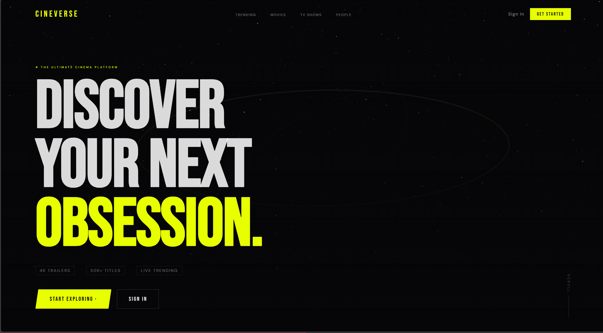
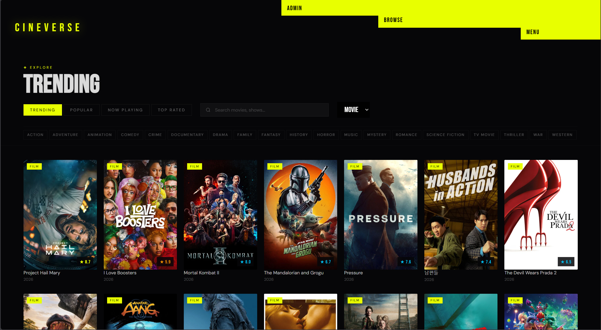
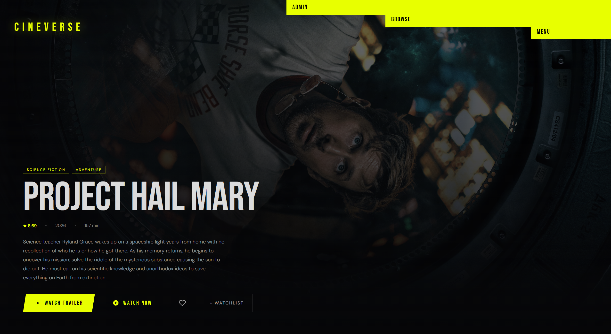
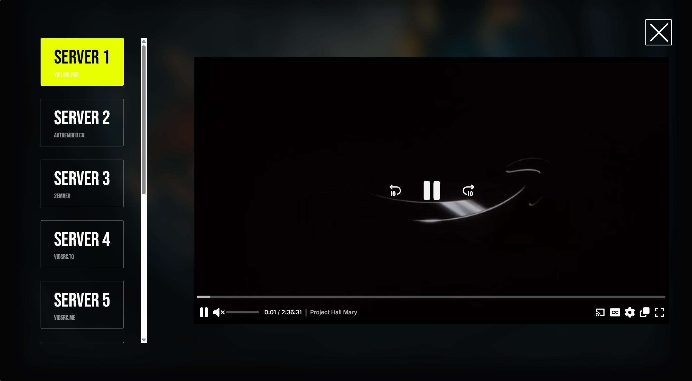
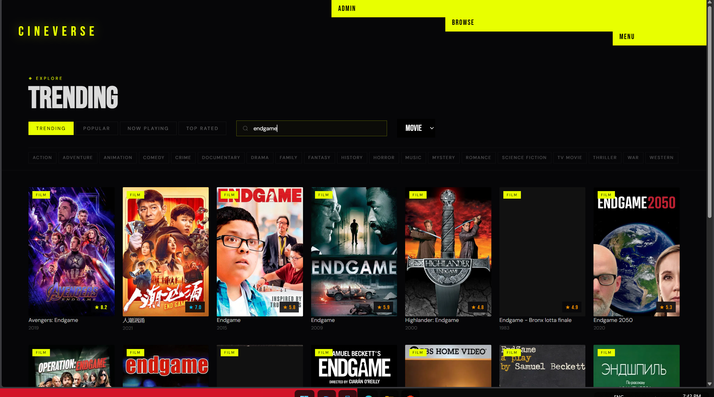

# 🎬 CineVerse

<div align="center">


### 🌐 Live Demo

**🚀 https://cineverse-lake-theta.vercel.app/**


### Discover • Stream • Explore

A modern full-stack movie and TV show streaming platform built with **React**, **Express.js**, and **TMDB API**.


</div>

---

## 📖 About

CineVerse is a full-stack movie streaming platform where users can discover trending movies and TV shows, search for their favorite titles, view detailed information, and watch content using multiple streaming servers.

The application fetches movie and TV show metadata using **TMDB IDs**, ensuring accurate and up-to-date information. Streaming is provided through embedded third-party servers using **iFrames**, along with alternative external watch links for better availability.

> **Disclaimer:** CineVerse does **not** host, upload, or distribute any copyrighted content. All media is streamed from publicly available third-party sources.

---

# ✨ Features

### 🎥 Movies & TV Shows
- Browse Trending Movies
- Browse Trending TV Shows
- Popular Movies & Series
- Upcoming Movies
- Top Rated Movies
- Search Movies & TV Shows
- Detailed Information Page

### 📄 Movie Details
- High Quality Posters
- Backdrops
- Ratings
- Genres
- Runtime
- Release Date
- Cast Information
- Overview

### ▶️ Streaming
- Multiple Streaming Servers
- Embedded iFrame Player
- Switch Between Servers
- Alternative External Watch Links

### 👤 User Features
- User Authentication
- Login & Signup
- Protected Routes
- User Profile

### 🎨 UI
- Fully Responsive
- Modern Interface
- Fast Navigation
- Mobile Friendly

---

# 🛠 Tech Stack

## Frontend

- React.js
- Vite
- React Router
- Redux Toolkit
- Axios
- CSS

## Backend

- Node.js
- Express.js
- MongoDB
- Mongoose
- JWT Authentication
- Cookie Parser
- CORS

## APIs & Services

- TMDB API
- Multiple Third-Party Streaming Servers
- External Watch Links

---

# 📂 Folder Structure

```text
CineVerse/
├── Backend/
│   ├── src/
│   │   ├── config/
│   │   ├── controllers/
│   │   ├── middlewares/
│   │   ├── models/
│   │   ├── routers/
│   │   └── app.js
│   ├── server.js
│   ├── package.json
│   └── .env
│
├── Frontend/
│   ├── public/
│   ├── src/
│   │   ├── assets/
│   │   ├── Features/
│   │   │   ├── Auth/
│   │   │   ├── Movies/
│   │   │   ├── Shared/
│   │   │   └── User/
│   │   ├── App.jsx
│   │   ├── AppRoutes.jsx
│   │   └── main.jsx
│   ├── index.html
│   ├── vite.config.js
│   ├── package.json
│   └── .env
│
└── README.md
```

---

# ⚙️ Installation

## 1. Clone the Repository

```bash
git clone https://github.com/your-username/CineVerse.git
```

```bash
cd CineVerse
```

---

## 2. Install Backend

```bash
cd Backend
npm install
```

---

## 3. Install Frontend

```bash
cd ../Frontend
npm install
```

---

# 🔑 Environment Variables

## Backend `.env`

```env
PORT=5000
MONGO_URI=your_mongodb_connection
JWT_SECRET=your_secret_key
TMDB_API_KEY=your_tmdb_api_key
```

## Frontend `.env`

```env
VITE_API_URL=http://localhost:5000
VITE_TMDB_IMAGE=https://image.tmdb.org/t/p/original
```

---

# ▶️ Running the Project

## Start Backend

```bash
cd Backend
npm run dev
```

---

## Start Frontend

```bash
cd Frontend
npm run dev
```

Open:

```
http://localhost:5173
```

---

# 🚀 How It Works

1. User searches or selects a Movie/TV Show.
2. TMDB ID is used to fetch metadata.
3. Backend processes the request.
4. Frontend displays:
   - Poster
   - Backdrop
   - Overview
   - Rating
   - Genres
   - Release Date
5. TMDB ID is passed to different streaming servers.
6. Movie/TV Show is embedded using an iFrame.
7. Users can switch servers or use external watch links.

---

## 📸 Screenshots

### Home Page


### Trending Movies


### Movie Details


### Watch Page


### Search Results


---

# 🔒 Authentication

- JWT Authentication
- Protected Routes
- Secure Cookies
- User Login
- User Registration

---

# 🌐 API Usage

Movie and TV show information is fetched using **The Movie Database (TMDB)**.

Data includes:

- Posters
- Backdrops
- Ratings
- Genres
- Runtime
- Overview
- Cast
- Release Dates

---

# 📺 Streaming

Streaming is handled through multiple embedded third-party servers.

Features include:

- Multiple Server Support
- Embedded iFrame Player
- Server Switching
- External Streaming Links

---

# 📌 Future Improvements

- Watchlist
- Favorites
- Continue Watching
- Episode Tracking
- Video Trailers
- Reviews
- Recommendations
- Dark/Light Theme
- PWA Support
- Admin Dashboard

---

# ⚠️ Disclaimer

This project is created **for educational purposes only**.

- CineVerse does **not host** any movies or TV shows.
- No copyrighted content is stored on this server.
- All streaming content is embedded from publicly available third-party providers.
- Users are responsible for complying with the copyright laws applicable in their country.

---

# 🤝 Contributing

Contributions are welcome!

1. Fork the repository
2. Create a new branch

```bash
git checkout -b feature-name
```

3. Commit changes

```bash
git commit -m "Added new feature"
```

4. Push

```bash
git push origin feature-name
```

5. Open a Pull Request

---

# ⭐ Support

If you like this project, consider giving it a ⭐ on GitHub.

---

# 📄 License

This project is licensed under the **MIT License**.

---

<div align="center">

### 🎬 CineVerse

**Discover. Stream. Explore.**

Made with ❤️ using React, Express.js & TMDB API

</div>
